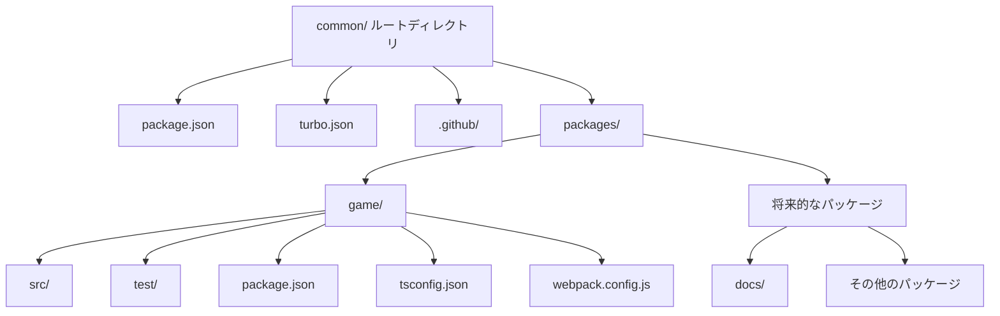
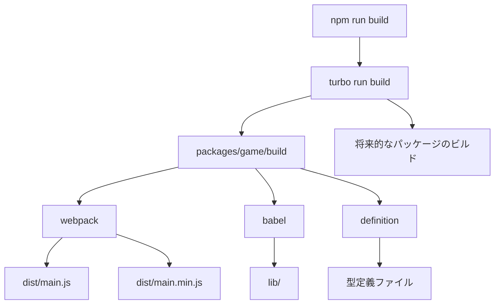
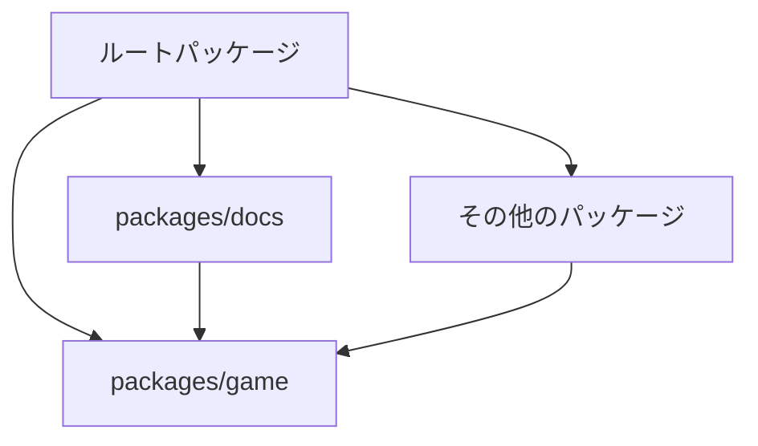

以下がモノレポ化の詳細な計画です。この計画でよろしいでしょうか？

# モノレポ化計画: @hackforplay/common

このプロジェクトをモノレポ構造に変換するための詳細な計画を作成しました。この計画では、現在のコードベースを `game` パッケージに移動し、将来的に他のパッケージ（例：`docs`）を追加できるようにします。

## 目標

- 現在のコードベースを `game` パッケージに移動する
- npm workspaces と Turborepo を使用してモノレポ構造を設定する
- 後方互換性を維持する
- 将来的に新しいパッケージを簡単に追加できるようにする
- 共有設定と個別設定の両方をサポートする

## 現状分析

現在のプロジェクト構造:

```
common/
├── .github/
├── src/
│   ├── enchantjs/
│   ├── feeles/
│   ├── hackforplay/
│   ├── mod/
│   ├── resources/
│   └── ...
├── test/
├── types/
├── package.json
├── tsconfig.json
├── webpack.config.js
└── ...
```

主な特徴:

- プロジェクト名: `@hackforplay/common`
- ビルドツール: webpack + babel
- テスト: ava
- TypeScript を使用
- 主なエントリーポイント: `src/index.ts` と `src/register.js`

## モノレポ構造への変換計画

### 1. ディレクトリ構造の再編成

新しいディレクトリ構造:

```
common/
├── .github/
├── packages/
│   └── game/
│       ├── src/
│       │   ├── enchantjs/
│       │   ├── feeles/
│       │   ├── hackforplay/
│       │   ├── mod/
│       │   ├── resources/
│       │   └── ...
│       ├── test/
│       ├── types/
│       ├── package.json
│       ├── tsconfig.json
│       └── webpack.config.js
├── package.json (ルート)
├── turbo.json
└── ...
```

### 2. パッケージ設定

#### ルートの package.json

```json
{
  "name": "@hackforplay/monorepo",
  "private": true,
  "workspaces": ["packages/*"],
  "scripts": {
    "build": "turbo run build",
    "test": "turbo run test",
    "lint": "turbo run lint",
    "format": "prettier --write ."
  },
  "devDependencies": {
    "prettier": "2.8.8",
    "turbo": "^1.10.0"
  }
}
```

#### turbo.json

```json
{
  "$schema": "https://turbo.build/schema.json",
  "pipeline": {
    "build": {
      "dependsOn": ["^build"],
      "outputs": ["dist/**", "lib/**"]
    },
    "test": {
      "dependsOn": ["build"],
      "outputs": []
    },
    "lint": {
      "outputs": []
    }
  }
}
```

#### game パッケージの package.json

現在の package.json をベースに、以下の変更を加えます:

```json
{
  "name": "@hackforplay/common",
  "version": "0.11.16",
  "description": "Common package for building stages in hackforplay",
  "main": "lib/index.js",
  "unpkg": "dist/main.min.js",
  "files": ["src", "dist"],
  "scripts": {
    "build": "webpack && npm run babel && npm run definition",
    "definition": "ts-node src/make-definition.ts",
    "start": "webpack-dev-server",
    "prepublishOnly": "npm run build; npm test",
    "babel": "babel -d lib -D src --extensions '.js,.ts'",
    "format": "prettier --write .",
    "lint": "npx eslint src --ext .js,.ts && npx prettier --check .",
    "test": "npm run lint && ava",
    "watch": "ava --watch",
    "resources": "gsutil -m -h \"Cache-Control:public, max-age=3600\" cp -r src/resources gs://hackforplay-common",
    "cors": "gsutil cors set cors.json gs://hackforplay-common",
    "semantic-release": "semantic-release"
  }
  // 依存関係は現在のものを維持
}
```

### 3. 設定ファイルの共有と個別化

#### 共有設定

共有設定ファイルをルートディレクトリに配置します:

- `.prettierrc` - コード整形の共有設定
- `.eslintrc.json` - リントの共有設定
- `tsconfig.base.json` - TypeScript の基本設定

#### パッケージ固有の設定

各パッケージには、パッケージ固有の設定ファイルを配置します:

- `tsconfig.json` - パッケージ固有の TypeScript 設定（共有設定を拡張）
- `webpack.config.js` - パッケージ固有のビルド設定

### 4. ビルドプロセスの更新

webpack.config.js を更新して、新しいディレクトリ構造に対応させます:

```javascript
const path = require('path');

const common = {
  entry: {
    main: './src/',
    register: './src/register'
  },

  resolve: {
    extensions: ['.ts', '.tsx', '.js', '.json']
  },

  module: {
    rules: [
      {
        include: [path.resolve(__dirname, 'src')],
        loader: 'babel-loader',
        test: /\.[jt]s$/
      },
      {
        test: /\.(png|jpg|gif)$/i,
        use: [
          {
            loader: 'url-loader'
          }
        ]
      }
    ]
  },

  output: {
    library: 'HackforPlayCommon',
    libraryTarget: 'umd'
  },

  optimization: {
    splitChunks: {
      cacheGroups: {
        vendors: {
          priority: -10,
          test: /[\\/]node_modules[\\/]/
        }
      },

      chunks: 'async',
      minChunks: 1,
      minSize: 30000,
      name: false
    }
  }
};

module.exports = [
  {
    ...common,
    mode: 'development',
    output: {
      ...common.output,
      filename: '[name].js'
    },
    devServer: {
      hot: false,
      headers: {
        'Access-Control-Allow-Origin': '*',
        'Access-Control-Allow-Methods': '*'
      },
      static: {
        directory: path.join(__dirname, 'dist')
      },
      allowedHosts: ['*']
    }
  },
  {
    ...common,
    mode: 'production',
    output: {
      ...common.output,
      filename: '[name].min.js'
    }
  }
];
```

### 5. CI/CD パイプラインの更新

GitHub Actions ワークフローファイルを更新して、モノレポ構造に対応させます:

#### .github/workflows/test.yml

```yaml
name: Test

on:
  pull_request:
    branches:
      - '*'

jobs:
  test:
    runs-on: ubuntu-latest

    steps:
      - uses: actions/checkout@v4
      - name: Use Node.js
        uses: actions/setup-node@v4
        with:
          cache: 'npm'
          node-version: '18'
      - name: Install
        run: npm ci
      - name: Build
        run: npm run build
      - name: Test
        run: npm run test
```

#### .github/workflows/release.yml

```yaml
name: Release

on:
  push:
    branches:
      - '*'
  release:
    types: [published]

jobs:
  build:
    runs-on: ubuntu-latest

    steps:
      - name: Check if GitHub PAT is valid
        run: |
          response=$(curl -o /dev/null -s -w "%{http_code}\n" \
                    -H "Authorization: token ${{ secrets.PERSONAL_ACCESS_TOKEN }}" \
                    -H "Accept: application/vnd.github.v3+json" \
                    https://api.github.com/user)

          if [ "$response" -ne 200 ]; then
            echo "GitHub PAT is invalid or expired"
            exit 1
          fi

      - uses: actions/checkout@v4
      - name: Setup gcloud environment
        uses: google-github-actions/setup-gcloud@v2
        with:
          service_account_key: ${{ secrets.GCLOUD_SERVICE_KEY }}
      - name: Use Node.js 18
        uses: actions/setup-node@v4
        with:
          node-version: '18'
      - run: npm ci
      - name: Run semantic-release
        run: npx semantic-release
        env:
          GH_TOKEN: ${{ secrets.PERSONAL_ACCESS_TOKEN }}
          NPM_TOKEN: ${{ secrets.NPM_TOKEN }}
      - run: |
          npm run build
          npm test
        if: ${{ github.event_name == 'pull_request' }}
      - run: |
          echo $GITHUB_REF
          PATCH_VERSION=${GITHUB_REF/refs\/tags\/v/}
          MINOR_VERSION=${PATCH_VERSION%.*}
          echo $PATCH_VERSION
          echo $MINOR_VERSION
          echo ${{ github.event_name }}
      - name: Build and Upload
        if: startsWith(github.ref, 'refs/tags/v')
        run: |
          cd packages/game
          npm run build
          PATCH_VERSION=${GITHUB_REF/refs\/tags\/v/}
          MINOR_VERSION=${PATCH_VERSION%.*}
          echo $PATCH_VERSION
          echo $MINOR_VERSION
          gsutil cp -r dist gs://cdn.hackforplay.xyz/common/${PATCH_VERSION}
          gsutil cp -r 'dist/**' gs://cdn.hackforplay.xyz/common/${MINOR_VERSION}
          gsutil cp -r 'dist/ja/*' gs://cdn.hackforplay.xyz/common/${MINOR_VERSION}/ja/
```

### 6. 実装手順

1. **準備**:

   - プロジェクトのバックアップを作成
   - 新しいブランチを作成

2. **ディレクトリ構造の変更**:

   - `packages/game` ディレクトリを作成
   - 現在のソースコードを `packages/game` に移動
   - ルートの `package.json` を作成
   - `turbo.json` を作成

3. **設定ファイルの更新**:

   - 共有設定ファイルをルートに配置
   - パッケージ固有の設定ファイルを更新

4. **ビルドとテスト**:

   - ルートディレクトリで `npm install` を実行
   - `npm run build` を実行してビルドが成功することを確認
   - `npm run test` を実行してテストが成功することを確認

5. **CI/CD パイプラインの更新**:

   - GitHub Actions ワークフローファイルを更新

6. **ドキュメントの更新**:
   - README.md を更新して新しいモノレポ構造を説明
   - 新しいパッケージの追加方法を説明

## 新しいパッケージの追加方法

将来的に新しいパッケージを追加する場合の手順:

1. `packages/` ディレクトリに新しいパッケージディレクトリを作成
2. パッケージの `package.json` を作成
3. 必要な設定ファイルを追加
4. ルートの `package.json` の workspaces に新しいパッケージを追加（自動的に検出されるため不要）
5. 依存関係を設定（パッケージ間の依存関係がある場合）

例えば、`docs` パッケージを追加する場合:

```
packages/docs/
├── package.json
├── tsconfig.json
└── ...
```

## Mermaid 図: モノレポ構造



## Mermaid 図: ビルドプロセス



## Mermaid 図: パッケージ間の依存関係



この計画でよろしければ、マークダウンファイルとして保存しますか？また、実装に進みたい場合は、Code モードに切り替えることができます。
